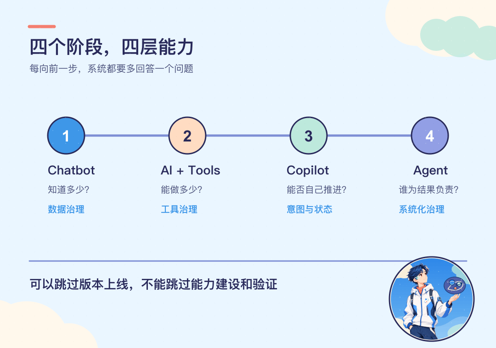
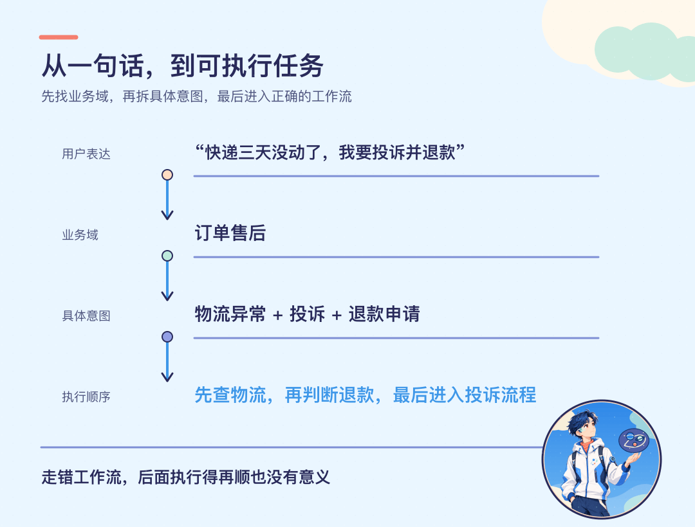
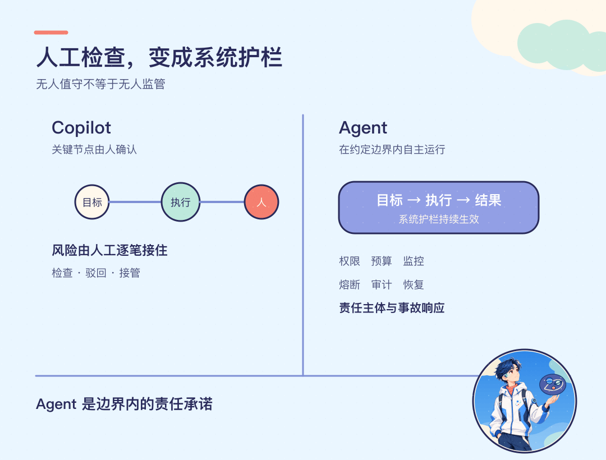
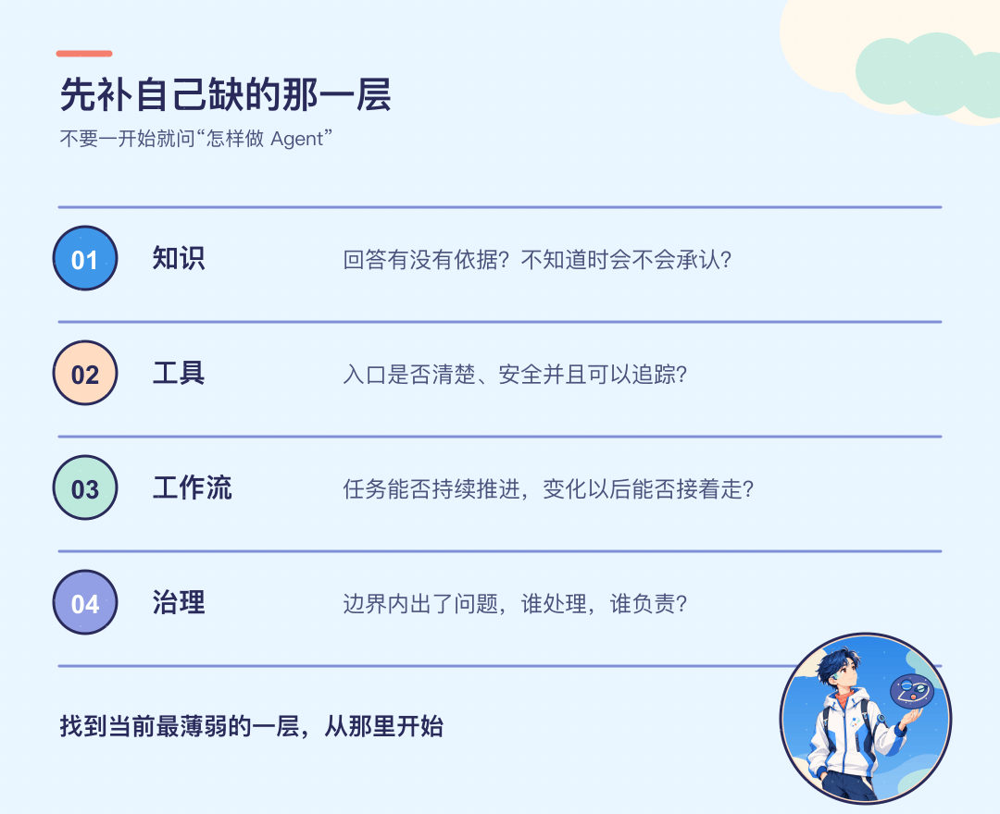

写完 gptpmt 这套教程以后，我一直在忙各种事情，很久没有真正静下心来，系统地写一篇文章了。

从 2022 年接触 ChatGPT，到 2023 年开始写 gptpmt，再到后来参与企业 AI 实践，前后已经三年多。这段时间做了不少尝试，也看到了很多企业在落地 AI 时遇到的问题。

最近，身边越来越多朋友会问一个问题：企业已经有很多业务系统了，到底应该怎样接入 AI？

这个问题看起来像是一个技术问题：选什么模型，用什么框架，怎样调用接口。

但真正开始做以后会发现，模型反而只是其中很小的一部分。企业内部的数据能不能使用，原来的接口是否清楚，多个业务流程怎样衔接，AI 做错以后由谁处理，这些问题都会一起出现。

我们先从一个最常见的智能客服场景开始。

假如一个用户打开客服窗口，问了一句：

> “我的订单为什么还没发货？”

窗口里的 AI 先说了一大段物流可能延迟的原因，最后又让用户提供订单号。用户提供以后，它仍然查不到，只能转给人工。

企业花了不少时间做智能客服，结果客服的工作量没有减少，反而多了一件事：替 AI 解释。

为什么会这样？

问题不一定出在模型，而是一个只会回答问题的系统，被直接拿去做了一个需要查询、判断、执行和承担风险的任务。

这就像盖房子。还没有打好地基，就开始讨论顶层怎样装修，最后往往不是房子盖得慢，而是盖到一半才发现下面根本支撑不住。

企业老系统接入 AI，同样需要一层一层地补齐能力。大致可以拆成四个阶段：Chatbot、AI + Tools、Copilot、Agent。

这不是一个行业标准，而是一套检查能力的框架。企业可以不把每个中间版本都正式上线，但数据、工具、任务和治理这几层能力，不能跳过去。

## 第一阶段：Chatbot，先把问题回答对

先把问题变简单。

用户不问自己的订单，只问：“一般付款以后多久发货？”

这时候，AI 不需要进入业务系统。只要企业把发货规则、退款政策、商品资料和常见问题整理好，它就可以回答。

Chatbot 到这里，做的是根据企业知识回答通用问题。

比如营业时间、产品介绍、报销制度、售后规则，这些答案通常已经存在于企业的文档里。过去需要员工自己搜索，现在可以直接用自然语言提问，再由 AI 找到相关内容并组织成答案。

这么看，好像只需要把文档放进去就可以了。

但问题一旦涉及具体订单，它就不知道了。它不知道用户是谁、有哪些订单，也不知道当前订单处于什么状态。继续回答，就只能根据通用规则猜。

所以，第一阶段有一个很明确的边界：它可以回答企业知识里已经存在的问题，但不能假装知道正在发生的业务事实。

### 从阶段零到第一阶段，关键不是模型，而是数据治理

很多企业一开始会把几百万字的飞书文档、产品手册和客服记录一股脑交给 AI，以为文档越多，回答就越好。

其实文档多，不等于知识可用。

想象一下，厨房里放着几十个一模一样的调料瓶，没有标签，也没有固定位置。做饭的人当然知道这里面肯定有盐、糖、醋和胡椒，可真正需要的时候，还是要一个一个打开去闻。

企业里的文档经常就是这样。

同一条退款政策可能有三个版本；某个产品已经下架，旧话术还在；一份文件写“包”，到底是箱包、套餐，还是某段话里的包子，也没有分类。相同的词在不同部门里可能完全不是一个意思，同一个业务名在不同年份又可能换过几次叫法。

人都要翻半天，AI 同样会找错。

更麻烦的是，AI 的回答很流畅。它把旧政策和新政策拼在一起时，普通用户未必能看出哪里不对。错误答案看起来越像正确答案，带来的风险反而越大。

所以第一层要补的是数据治理。至少要把下面几件事讲清楚：

- 哪些内容是准确的，哪些已经失效；
- 文档应该怎样分类，一个问题应该去哪里检索；
- 相同概念在不同系统中叫什么，是否需要建立统一词表；
- 不同身份能够看到哪些内容，敏感信息怎样隔离；
- 谁负责更新，旧版本什么时候下线；
- 回答到什么程度算正确，怎样持续发现错误。

AI 可以参与分类、去重和整理，但分类体系、维护责任和验收标准，还是要由企业自己定义。

这里需要注意，数据治理并不是做一次大扫除，然后就结束了。业务规则会变化，产品会下线，组织会调整，今天正确的内容半年后可能就不再正确。知识库必须有持续维护的入口，否则它很快又会变回原来的样子。

做到这里，客服不只是“接入了大模型”，而是能够依据有效的企业知识回答问题。找不到依据时，它应该直接说不知道，而不是编出一个看起来合理的答案。

怎样判断第一阶段是否做完了？

不是看演示时能不能回答几个提前准备的问题，而是看真实用户换一种说法、连续追问、问到权限边界时，系统还能不能找到正确依据。只有这一步稳定了，才有必要继续往业务系统里面走。

## 第二阶段：AI + Tools，让 AI 查到这笔订单

到了第二阶段，问题开始涉及具体订单。

要回答开头那个问题，AI 需要调用订单查询工具，拿到这个用户的订单和物流状态。查到订单还在仓库里，它才能告诉用户真正的原因。

如果用户进一步要求退款，系统还要再调用退款工具。

到了这一步，AI 已经不只是读企业知识，它可以使用业务系统做一件具体的事。这就是 AI + Tools。

Tools 可以理解为企业提供给 AI 的一组能力入口。查询订单是一个工具，获取物流是一个工具，计算退款金额是一个工具，真正提交退款又是另一个工具。

AI 负责理解用户说的话，选择合适的工具，再把工具返回的数据组织成用户能够看懂的结果。

听起来也不复杂。问题也跟着来了。

一个老系统里，可能同时存在十几个退款接口。有的是旧版本，有的只退优惠券，有的要传内部字段，还有的执行失败以后不会返回清楚的原因。

把这些接口全部交给 AI，让它自己猜应该用哪一个，并不会让老系统变聪明，只会把原来藏着的问题暴露出来。

以前这些接口由熟悉系统的开发人员调用。他们知道哪个能用，哪个只是历史遗留，哪个参数虽然写着可选，实际上不传就会报错。AI 并不知道这些默认知识，它只能根据提供的说明去判断。

如果工具名称含糊、参数定义不完整、返回结果不统一，再强的模型也可能选错。

### 从第一阶段到第二阶段，关键是工具治理

工具治理不是简单地把旧接口包装一下，而是重新回答几个基本问题：

- 这个工具到底解决什么问题，什么情况下不能使用；
- 调用时必须提供哪些参数，参数从哪里获得；
- 返回成功、失败和部分成功时，分别是什么结构；
- 哪些角色有权调用，能够读取和修改哪些数据；
- 查询类操作可以调用多少次，修改类操作是否需要确认；
- 同一次请求重复到达时，怎样避免重复退款或重复创建订单；
- 每一次调用由谁发起、输入了什么、结果是什么，能不能完整追溯。

其中很容易被忽略的一点，是幂等。

假如退款工具调用以后网络超时，AI 不知道退款到底有没有成功，于是又调用一次。如果接口没有防重复机制，同一笔订单就可能被退两次。

这不是模型聪明不聪明的问题，而是工具本身有没有为自动化调用做好准备。

所以，先让维护系统的人能够讲清楚这个工具怎么用，再把它交给 AI。工具越少、职责越清楚，AI 越容易做对。十几个历史接口最好收敛成少数稳定的业务能力入口，而不是把复杂度全部推给模型。

到了这里，还要区分两件事：执行一条指令，和完成一个任务。

查询订单、读取物流、发起退款，分别都是明确的指令。用户说一步，AI 调用一个工具，拿到结果以后停下来，这属于 AI + Tools。

但如果只告诉它最终目标，让它自己判断先做什么、后做什么，中间遇到问题还要继续处理，那么事情就进入了下一阶段。

## 第三阶段：Copilot，让任务自己往下走

再加一个条件：查一下这笔订单，如果还没有发货就直接退款。

这次不是调用一个工具就结束了。系统要先确认用户和订单，再查询物流，判断是否符合退款条件，计算金额，发起退款，最后把结果告诉用户。

AI + Tools 更像是人说一步，AI 做一步。Copilot 则是人给出目标，AI 围绕目标把几步串起来；遇到不确定或高风险的地方，再停下来让人处理。

这个过程中，AI 需要不断重复一个循环：理解当前目标，判断下一步，调用工具，读取结果，再根据新的结果决定后续动作。

订单已经发出，就不应该继续走未发货退款；退款工具返回金额异常，就应该暂停；用户身份没有验证，也不能直接修改订单。每一步的结果，都会改变下一步应该做什么。

这就是任务闭环。

所以第二阶段和第三阶段的区别，不是 AI 能不能一次调用多个工具，也不是简单地从只读变成可写。真正的区别是：系统能不能围绕一个目标持续运行，直到任务完成、失败或者需要人接手。

但工具能够串起来以后，新的问题又会出现。

### 第一个问题：意图治理

真正麻烦的地方，往往不是某个工具不会调用，而是一开始走错了流程。

比如，用户发现快递三天没有更新，同时要求投诉和退款。

这个需求里同时有物流异常、投诉和退款。系统如果只识别成投诉，就可能一直安抚用户，却没有处理退款；如果直接退款，又可能漏掉订单状态和退款条件。

它需要先判断这是哪个业务域，再把一句模糊表达拆成可以执行的具体意图，并决定先后顺序。

为什么不能只做一个很大的意图分类，让 AI 在几百个选项里直接选？

因为真实企业的业务远比演示复杂。同一句“帮忙改一下”，在订单系统里可能是改地址，在差旅系统里可能是改签，在人事系统里又可能是修改员工资料。业务不断增加以后，所有意图放在同一层，分类会越来越混乱。

更合适的方式，是先做分层路由。

第一层先判断属于订单、物流、售后还是账户；进入订单以后，再判断是查询、修改、取消还是退款；如果一句话里包含多个意图，还要把它们拆开，并根据依赖关系安排顺序。

打车场景会更明显。

用户说“明天早上送到机场”，系统需要知道从哪里出发、几点的航班、要提前多久到；用户又说“顺便帮同行的人也叫一辆”，这里就出现了第二个乘车人、第二个出发点和可能不同的车型。如果所有信息都塞进一个简单的“叫车”意图里，后面的流程很容易混在一起。

意图治理不是给一句话贴一个标签，而是把用户真正想完成的事情，逐层收敛成系统能够执行的任务。

### 第二个问题：状态管理

接着再加一个变化。

系统已经查完订单，正准备退款，用户突然改变主意，要求先别退款，改一下收货地址。

合理的做法不是硬着头皮继续退款，也不是把前面的结果全部丢掉。系统要打断当前流程，保留已经查到的订单和物流信息，再判断改地址是否可行。

这就需要状态管理。系统既要知道前面聊了什么，也要知道任务做到了哪一步、哪些工具已经调用、哪些操作还能撤回。如果退款已经提交，还要进入取消或补偿流程，而不是假装什么都没发生。

这里至少有两类上下文。

一类是对话上下文，例如用户说的“这笔订单”指的是哪一笔，前面确认过什么信息。另一类是任务上下文，例如当前走到退款流程的哪一步，哪个工具已经成功，哪个动作还在等待确认。

只保存聊天记录并不够。聊天里可能写着“准备退款”，但系统还需要知道退款指令究竟有没有真正提交。反过来，只保存工具调用状态也不够，因为用户中途一句“还是算了”，会直接改变任务目标。

所以 Copilot 要能够处理几种变化：

- 任务被打断以后，已经完成的结果可以继续使用；
- 用户补充信息以后，流程能够从正确的位置恢复；
- 多个意图之间有依赖时，能够按照顺序执行；
- 已经产生副作用的操作失败时，能够回滚或进入补偿流程；
- 超出能力、信息不足或风险过高时，能够把任务交给人，并带上完整上下文。

意图治理决定有没有走对路，状态管理决定任务变化以后会不会迷路。

做到这些，AI 才不只是几个工具外面套了一层对话框，而是真正开始参与业务流程。

## 第四阶段：Agent，边界内的结果由谁负责

到了 Copilot，AI 已经可以理解目标、安排步骤并持续调用工具。那它和 Agent 还差什么？

差的是责任。

假如一套 AI 客服可以退款，一笔订单原本只能退 50 元，用户却通过诱导让它退了 5,000 元，最后由谁承担这个结果？

如果业务人员仍然要逐笔检查，出了问题以后又说“是审核的人没看清”，那这套系统仍然是 Copilot。AI 在执行，人还坐在旁边踩刹车。

Agent 意味着另一种承诺：在双方约定的运行边界内，业务人员可以不再逐笔审核；系统自主决策出了问题，交付这套 Agent 的团队要对结果负责。

这不是说 Agent 要无限兜底。

自动驾驶的 L2、L3 可以帮助理解这个变化。L2 仍然要求驾驶员持续监控，L3 则在限定条件下由系统承担更多驾驶任务，同时保留接管要求。这个类比只是在说明任务与监控责任的变化，不能用来推导具体事故中的法律责任。

具体事故由谁负责，还要看当地法律、产品承诺、运行条件和实际情况。Agent 也一样：边界必须提前写清楚，超出边界时要拒绝、降级或者转给人。

比如退款 Agent 只处理金额不超过 200 元、订单状态明确、用户身份已经验证的普通售后。超过金额、命中异常账户、规则发生冲突时，立即交给人工。

在这个范围内，它可以自己完成；超出范围，它不能为了追求完成率继续猜。

### 从 Copilot 到 Agent，关键是系统化监管

人工不再逐笔审核以后，监管并没有消失，只是从“人盯着每一步”，变成“系统自动管住风险”。

这套系统至少要管住几类问题：

- 权限：它可以访问哪些系统、读取哪些数据、执行哪些修改；
- 预算：一次任务最多调用多少次工具、消耗多少资源、处理多大金额；
- 监控：当前正在做什么，结果是否偏离目标，异常能不能及时发现；
- 风控：哪些规则绝对不能绕过，哪些情况必须重新验证身份；
- 熔断：连续失败、成本异常或行为失控时，系统能不能立即停下来；
- 回滚与补偿：操作已经执行一半时，怎样恢复到安全状态；
- 审计与评测：每一次判断能不能追溯，极端情况有没有反复测试；
- 责任机制：出了问题由谁响应，谁修复，谁承担约定范围内的结果。

这里的难点是，过去人工审核时存在于员工经验里的判断，要变成系统能够执行的规则。

一个客服看到异常退款，可能会凭经验觉得“不太对”。Agent 没有这种模糊的默契。企业需要继续往下问：到底是金额异常、次数异常、账户异常，还是订单状态和申请理由不一致？哪些情况直接拒绝，哪些情况只需要二次确认，哪些情况必须转人工？

只有把这些经验说清楚，系统化监管才真正存在。

同样，评测也不能只看平均准确率。正常订单处理得再好，只要在极端输入下可以绕过权限，或者连续失败后仍然不停调用工具，就不能放到无人值守的环境里。

可靠的 Agent，不只是模型效果好，还要有明确的运行范围、持续监控、人工接管、事故响应和恢复能力。

按这套框架看，Agent 不是给 Copilot 换一个更流行的名字，而是对边界内自主结果作出的责任承诺。

## 企业应该从哪一层开始？

先不要问“怎样做一个 Agent”，看看当前系统缺什么。

如果企业知识还不准确，就先整理数据，不要急着让 AI 回答所有问题。

如果 Chatbot 已经能够说对，就把混乱的旧接口整理成清晰、安全、可追踪的工具。

如果工具已经能用，就去补意图治理和状态管理，让系统在正确的工作流里持续推进。

如果 Copilot 已经能够稳定完成多步任务，再把人工监督里真正有效的规则，沉淀为系统能够执行的权限、风控、熔断、审计和责任机制。

可以把这四层行动再说得具体一点。

### 第一层：先整理知识

挑一个边界清楚、问题集中的业务场景，不要一开始就把整个企业的文档全部放进去。先确认知识来源、分类方式、权限和维护人，再用真实问题反复测试。

### 第二层：再整理工具

从查询类工具开始，让入口和返回结果稳定下来。涉及修改数据的工具，要把权限、确认、幂等和审计放在前面，不要等到出错以后再补。

### 第三层：建立任务闭环

选择一个步骤不太多、结果容易验收的流程，验证意图拆分、任务状态、打断恢复和人工接管。能稳定走完一个流程，比同时做十个半成品更有价值。

### 第四层：逐步扩大自主边界

先写清楚哪些任务允许无人值守，再为这个范围配置预算、监控、风控、熔断、补偿和责任人。验证稳定以后，再一点点扩大，而不是一开始就追求什么都能做。

某个中间版本可以不正式上线，但它背后的能力建设和验证不能跳过。

这四个阶段也不是要求所有企业都走到最后。有的业务停在 Chatbot 就够了，有的操作风险很高，长期保留人工确认反而更合适。

## 写在最后

Chatbot、AI + Tools、Copilot、Agent，并不是一套所有企业都必须照着执行的行业标准，也不是说走到第四阶段才算成功。

这套划分真正想解决的，是另一个更实际的问题：当一个 AI 项目做不下去时，我们能不能看清楚缺的到底是什么？

回答不准确，先看知识和数据；工具经常选错，先看接口和权限；流程走不下去，先看意图与状态；不敢让系统自主运行，再看监管和责任。

每往前走一步，都会暴露出下一层原来被人掩盖的问题。以前靠员工经验记住的规则，会变成数据问题；以前靠开发人员默契调用的接口，会变成工具问题；以前靠业务人员盯着处理的异常，会变成治理问题。

这些问题不是接入一个更强的模型就会自动消失。

现在所有人都还在探索，很多概念的边界也会继续变化。与其急着证明已经做出了 Agent，不如先选一个真实场景，让系统稳定地回答对一个问题、调用好一个工具、完成好一段流程。

实践会告诉我们下一步缺什么。

先判断当前在哪一层，再把这一层真正补好。企业老系统接入 AI，才不会只是多了一个看起来很聪明的对话框。

## 参考资料

- NHTSA，[Automated Vehicle Safety](https://www.nhtsa.gov/vehicle-safety/automated-vehicle-safety)；SAE，[J3016 Levels of Driving Automation](https://www.sae.org/binaries/content/assets/cm/content/blog/sae-j3016-visual-chart_5.3.21.pdf)。
- NIST，[AI Risk Management Framework Core](https://airc.nist.gov/airmf-resources/airmf/5-sec-core/)。
- Anthropic，[Building Effective AI Agents](https://www.anthropic.com/engineering/building-effective-agents)。

## 关注公众号

如果你也在关注企业 AI、Agent 和真实业务落地，欢迎关注公众号「刘路飞」。后面还会继续聊这些问题。
